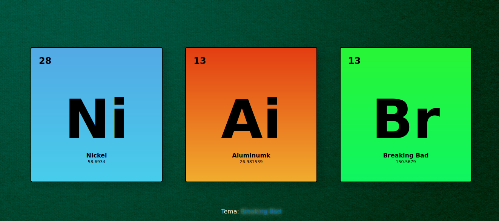

# Elementos
### testando @keyframes

## Pré visu:


## HTML:
```
    <!DOCTYPE html>
<html lang="en">
<head>
    <meta charset="UTF-8">
    <meta name="viewport" content="width=device-width, initial-scale=1.0">
    <title>Elemento da Tabela PERIODICA</title>
    <link rel="stylesheet" href="css/estilinho.css">
</head>
<body>
    <main>
        <section>
            <div class="el28">
            <h2>28</h2>
        </div>
        <article>
        <div class="elNi">
            <h1>Ni</h1>
            <h5>Nickel</h5>
            <p>58.6934</p>
        </div>
    </article>
        </section>
        <section class="ai">
            <div class="el28">
            <h2>13</h2>
        </div>
        <article>
        <div class="elNi">
            <h1>Ai</h1>
            <h5>Aluminumk</h5>
            <p>26.981539</p>
        </div>
    </article>
        </section>
    </section>
    <section class="b">
        <div class="el28">
        <h2>13</h2>
    </div>
    <article>
    <div class="elNi">
        <h1>Br</h1>
        <h5>Breaking Bad</h5>
        <p>150.5679</p>
    </div>
</article>
    </section>
    </main>
    <footer>
        <p>Tema:</p> <span>Breaking Bad</span>
    </footer>
</body>
</html>
```

## CSS:
```
    *{
    padding: 0;
    margin: 0;
    box-sizing: border-box;
    font-family: Verdana, Geneva, Tahoma, sans-serif;
}
html,body{
    height: 100%;
    background-image: url("../img/smooth-green-background.jpg");
    background-position: center;
    background-repeat: no-repeat;
    background-size: cover;
}

main{
    position: relative;
    display: flex;
    justify-content: center;
    top: 50%;
    transform: translateY(-50%);
}
main > section{
    width: 100%;
    max-width: 350px;
    height: 360px;
    padding: 20px;
    background: linear-gradient(#53a9e5,#48cdeb);
    border-radius: 5px;
    box-shadow: 10px 10px 15px 5px #00000024;
    border: 2px solid #000000;
    animation-name: tabanin;
    animation-duration: 3s;
    position: relative;
    animation-iteration-count: 1;
    margin: 30px;
}
main > section > article{
    position: relative;
    width: inherit;
    height: inherit;
    display: flex;
    top: 50%;
    transform: translateY(-50%);
    flex-direction: column;
    justify-content: center;
    align-items: center;
    text-align: center;
}
.elNi h1{
    font-size: 9em;
}
.elNi h5{
    font-size: 1em;
}
.elNi p{
    font-size: 0.7em;
}
@keyframes tabanin{
    0%{
        opacity: 0;
        background-color: red;
        top: 500px;
        rotate: 0deg;
    }
    50%{
        background-color: aqua;
        top: 0px;
        transform: scale(1);
        opacity: 1;
        rotate: 25deg;
    }
    100%{
        transform: scale(1.4);
        opacity: 0;
    }

}
.ai{
    background: linear-gradient(#e33d12,#f1ac2e);
}
.b{
    background: linear-gradient(#28f536,#0ff561);
}
footer{
    display: flex;
    justify-content:  center;
    align-items: center;
    top: 150px;
    position: relative;
}
footer span{
    color: white;
    animation-name: rgb;
    animation-duration: 2s;
    animation-iteration-count: infinite;
    text-shadow: 0px 0px 9px #ffffffbd;
    margin-left: 5px;
}
footer p{
    color: white;
}
@keyframes rgb{
    0%{
        color: red;
    }
    50%{
        color: rgb(0, 255, 0);
    }
    100%{
        color: blue;
    }
}
@media screen and (max-kwidth: 768px){
    html,body{
        display: flex;
        flex-direction: column;
    }
}

```